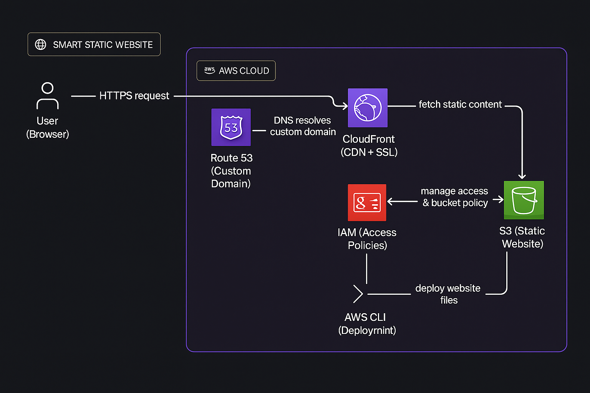
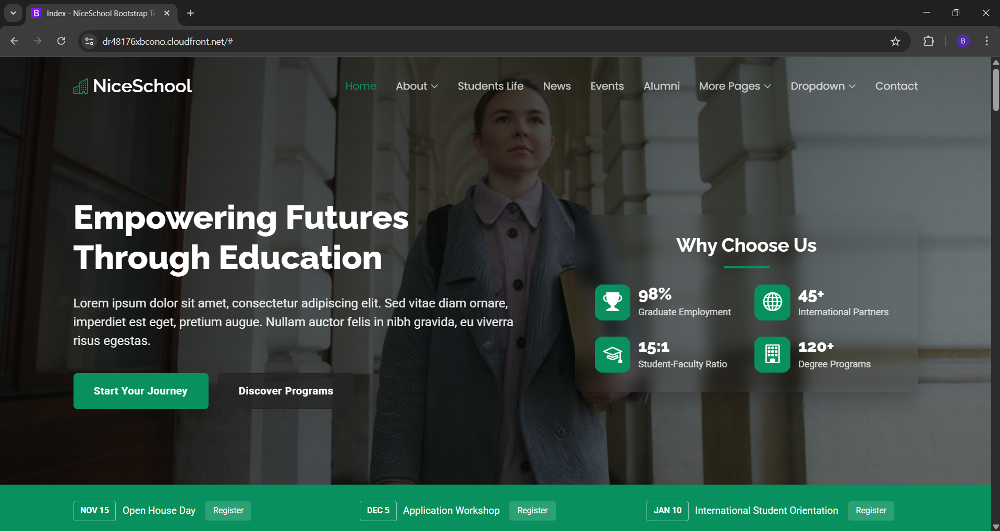

# 🌐 Smart Static Website (AWS Project)

A secure, scalable, and cost-effective static website hosted entirely on **AWS Free Tier services**. Designed and implemented by **Bharat Surya Jithuga** to showcase cloud skills with real-world infrastructure.

🔗 **Live Demo:** [Smart Static Website](https://dr48176xbcono.cloudfront.net/)

---

## 📌 Project Overview

This project demonstrates how to host a static website using **Amazon S3**, distributed securely through **CloudFront**, and optionally integrated with a **custom domain using Route 53**. It's ideal for personal portfolios, product pages, or blog hosting — with near-zero running costs on AWS Free Tier.

---

## 🧠 Learning Goals

✅ Understand AWS S3 static hosting  
✅ Configure CloudFront for secure, cached delivery  
✅ Use IAM to manage access securely  
✅ Automate deployments using AWS CLI  
✅ (Optional) Integrate custom domains via Route 53

---

## 🏗️ Architecture Diagram



---

## 🛠️ Tools & AWS Services Used

| Tool / Service         | Purpose                                |
|------------------------|-----------------------------------------|
| **Amazon S3**          | Static website file storage and hosting |
| **CloudFront**         | CDN and SSL (HTTPS) distribution        |
| **IAM**                | Access and bucket policy management     |
| **AWS CLI**            | Command-line deployment automation      |
| **Route 53** *(optional)* | Custom domain + DNS management     |

---

## 📸 Demo Screenshot



---

## 📂 Folder Structure

```bash
Smart-Static-Website/
├── assets/
│   ├── demo-screenshot.png
│   └── architecture.png
├── portfolio.pdf
├── src/                     # Actual static website files
├── README.md
└── .gitignore

🔐 Sample S3 Bucket Policy
json
Copy code
{
  "Version": "2012-10-17",
  "Statement": [
    {
      "Sid": "PublicReadGetObject",
      "Effect": "Allow",
      "Principal": "*",
      "Action": "s3:GetObject",
      "Resource": "arn:aws:s3:::nice-school-smart-website-bharat/*"
    }
  ]
}

🚀 Manual Deployment Steps
🔧 Step 1: Configure AWS CLI
bash
Copy code
aws configure
# Enter AWS Access Key, Secret Key, Region (e.g., ap-south-1), and output format
📤 Step 2: Upload to S3
bash
Copy code
aws s3 sync ./src s3://your-bucket-name --delete
This uploads your site and deletes outdated files from the bucket.

🔄 Step 3: Invalidate CloudFront Cache (Optional)
bash
Copy code
aws cloudfront create-invalidation \
  --distribution-id YOUR_DISTRIBUTION_ID \
  --paths "/*"
🎓 What I Learned from This Project
✅ Hosting a real website using Amazon S3 and CloudFront

✅ How to configure and apply IAM policies and S3 bucket policies

✅ Using AWS CLI to manage and automate deployments

✅ DNS concepts and how Route 53 integrates with CloudFront

✅ Setting cache behavior, HTTPS enforcement, and static error pages

✅ Making a fully functional, production-ready static website — at zero cost (AWS Free Tier)
