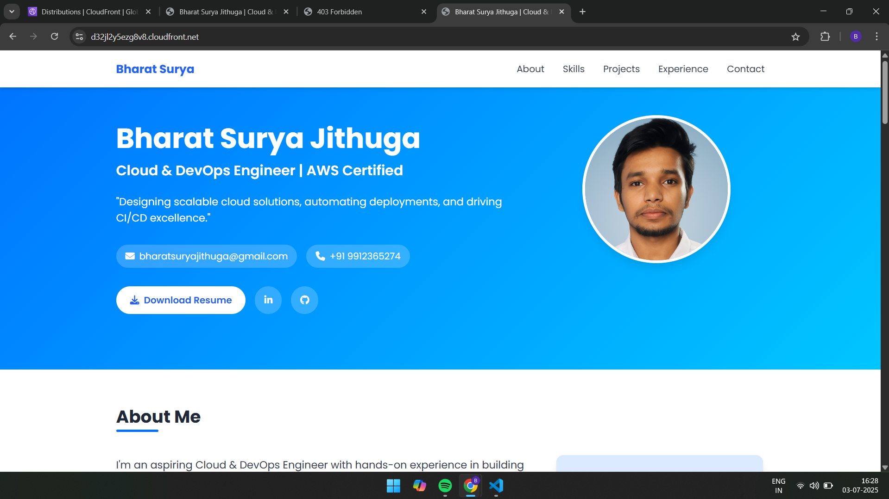

# 🌐 AWS Static Website Hosting: My First Cloud Project  
Welcome to my first hands-on AWS Cloud project! I successfully deployed a high-performance, globally accessible static website using Amazon S3 and CloudFront. This project gave me a strong foundation in AWS services and best practices for cloud hosting.  
## 🧠 Project Overview  
This project involved deploying a static website—composed entirely of HTML, CSS, JavaScript, and images—with no server-side code. Static sites are blazing fast, secure, scalable, and extremely cost-effective to host on AWS.  
### 🔑 Key AWS Services Used:  
- Amazon S3 – Used for hosting the website files.  
- Amazon CloudFront – Used as a CDN to cache and deliver content globally.  
- AWS IAM – Used to manage permissions and secure access.  
## 🚦 Difficulty & Duration  
- Level: Beginner  
- Time Taken: ~45 minutes (CloudFront setup took the most time)  
## ✅ Project Steps  
### Step 1: Crafted My Website Content  
I started by creating a minimal static website using:  
- index.html – My main page  
- error.html – Custom error page  

I organized the content in a simple directory structure:  
/index.html  
/error.html   
/images/  

The site is purely static, with no backend logic.  
### Step 2: Created the S3 Storage Bucket  
I created a new S3 bucket with:  
- A unique name: bharat-surya-jithuga-portfolio  
- Region: AP south (mumbai-1)  
- Public Access: Disabled block public access  
- Static Website Hosting: Enabled  

I set:  
- Index document: index.html  
- Error document: error.html  

After creation, I received a bucket website endpoint like:  
http://bharat-surya-jithuga-portfolio.s3-website-us-east-1.amazonaws.com/  
### Step 3: Uploaded Content & Configured Bucket Policy  
I uploaded all my website files to the bucket. Initially, I faced a 403 Forbidden Error because no bucket policy was set.  

To fix this, I added the following bucket policy to allow public read access:  

````bash
{  
  "Version": "2012-10-17",  
  "Statement": [  
    {  
      "Sid": "PublicReadGetObject",  
      "Effect": "Allow",  
      "Principal": "*",  
      "Action": [  
        "s3:GetObject"  
      ],  
      "Resource": [  
        "arn:aws:s3:::bharat-surya-jithuga-portfolio/*"  
      ]  
    }  
  ]  
}  
````

Once done, the site became publicly accessible via the S3 static website URL.  
### Step 4: Integrated with CloudFront for CDN & HTTPS  
Next, I created a CloudFront distribution to:  
- Cache my content globally  
- Provide free SSL (HTTPS)  
- Improve latency  

Before CloudFront, the site was not secure and showed warnings in the browser.  
Key CloudFront Settings:  
- Origin Domain: My S3 static website endpoint (not just the bucket name)  
- Origin Access: Used Origin Access Control (OAC) for tighter security  
- Viewer Protocol Policy: Redirect HTTP to HTTPS  
- Default Root Object: index.html  

Deployment took around 15 minutes to complete.  
### Step 5: Tested & Verified My Live Website  
Once the CloudFront distribution was enabled, I accessed the secure HTTPS version of my website using the CloudFront domain name:  
https://d32jl2y5ezg8v8.cloudfront.net/  

I verified:  
- Secure HTTPS connection (padlock in browser)  
- No 403/404 errors or JavaScript issues in the browser console  
## 🚀 Key Learnings  
Through this project, I learned to:  
- Use Amazon S3 to host static files  
- Configure bucket policies to allow public access  
- Deploy a CloudFront CDN for global delivery and HTTPS  
- Work with IAM permissions for secure resource access  
- Understand how static sites behave in cloud environments  
## 🧩 What’s Next?  
I'm planning to enhance this site by adding a contact form using:  
- AWS Lambda  
- Amazon API Gateway  

This will introduce some dynamic backend logic and elevate my cloud skills to the next level.  
## 💡 Pro Tips & Notes  
- Always monitor usage in the Billing Dashboard  
- S3 static hosting does not support HTTPS directly — CloudFront solves this  
- After the 12-month AWS Free Tier, charges may apply — clean up unused resources  

🌟 This was my first cloud deployment project on AWS – and it worked beautifully. I'm excited to build more complex solutions now!  


Happy deploying! ☁️🚀




